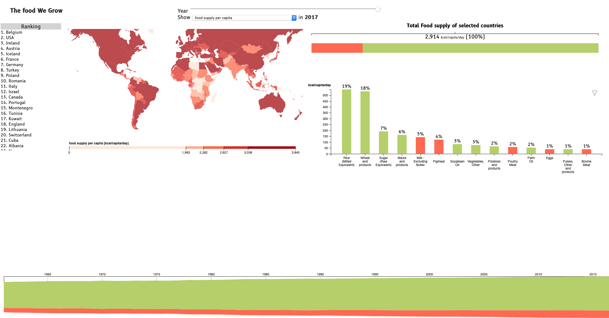

# InfoVis Lab Project
This is a group project which I worked with [Elias Gander](https://github.com/elias-gander) and [Florian Kisel](https://github.com/FlorianKiesl) in the Information Visualization Course in JKU.

## Dataset
  
The dataset gives detailed information about the production, import and utilization of food for every country in the world from 1961 to 2017. For every food item (e.g. Soybeans) the dataset indicates the quantity of:
  * Production (Input)
  * Import (Input)
  * Stock (Input)
  * Export (Output)
  * Feed (Output)
  * Seed (Output)
  * Losses (Output)
  * Processing (Output)
  * Food Supply (Output)

  This dataset was created and is maintained by the Food and Agriculture Organization of the United Nations (FAO).
  The dataset can be downloaded from the FAOSTAT website (http://www.fao.org/faostat/en/#data). It can be found there under 'Food Balance' -> (New) Food Balances. There are two datasets for food balances, one using an old methodology and covering years 1961 - 2013, the other covering year 2013 - 2017. We use both these datasets for our project and merged them into one in order to have data from 1961 - 2017.

  The sources for all the numbers in the dataset are (whenever available) official sources in the respective countries (i.e. governmental institutions). Most of this data is generated by surveys in the respective countries.
  If official sources cannot provide any data, the FAO may also gather data from research and large companies or calculate/estimate it from previous years.

  The merged dataset has around 250,000 rows and around 60 columns (the values for different years are contained in different columns).
  
  Each record of the dataset contains:
  * Country name and ID
  * Food Item and ID (e.g. Soybeans, 2546)
  * Element and ID (e.g. Export, 5110)
  * Unit (e.g. 1000 tonnes)
  * Values for the years 1961 - 2017

## User Tasks & Goals

* The user tasks:
Since the dataset contains a very broad range of information, our dashboard should foremostly enable users to explore the dataset. Thus, taking the tasks framework from the lecture, the high level tasks we focus on are __Discovery__ but also __Enjoyment__. On the mid level, users will mostly __browse__ the countries or food items they are interested in and then analyze the available data for this country or item. In terms of low level actions, users will want to __identify__ single countries or items but also __compare__ them. As a reference to single countries/items, __summarizing__ all countries/items or subgroups of them might make sense.

* What would users like to see/get from the dataset:
Most users will probably be interested in seeing data about their home country, the country they live in or other countries they are somehow interested in. Users can know which foods are produced with less transportation and help the comsumption more eco-friendly.       
Also they might be interested to find out more about the food production/utilization in a certain country if the country represents an outlier in some aspect (e.g. a country that imports the great majority of its food supply). Furthermore, insights to how much food is actually available for each one per country. 
Users might also be interested in certain food items (e.g. meat) and see what role this item plays in the world's food production or supply.  
Another dimension that might interest users is the development of various metrics over the year. Since the dataset covers a time period of almost 60 years, it should reveal some radical changes in food production and utilization on a national but also global level.  
Moreover, an interisting aspect for users is to compare the elements of a special item among countries over the years.
Finally different users will probably lay their focus on different areas of food production and utilization. Some might be more interested in the trade aspect, that is, import and export, other more on the agricultural aspect, i.e., production and feed/seed usage.

## Proposed Dashboard Solution

* Visualizations in this task:
    * A choropleth world map with a sequential color scheme in which countries can be compared regarding:
      * the food available for consumption in kcal/capita/day
      * tonnes of food produced per hectare of agricultural land
      * the percentage of produced food that is lost (during production, processing, in a household, etc.) 
      * the percentage of produced food that is exported to other countries
      * the percentage of food available for consumption that is imported from other countries
 
    * A single bar that shows the ratio between animal and vegetal products for the selected countries and selected series (i.e. production, export, ...). Users can click the bar segments to drill down to subcategories (i.e. Animal Products -> \[Dairy Products, Meat, ...\].
 
    * A (multi) bar chart showing the top food items for the selected countries and selected series. The color scheme of this chart follows that of the single bar (i.e. a food item bar will have the same color as the single bar segment that represents the food category this item belongs to). Users can filter the displayed food items either through a search field or by 'pinning' one or more food categories in the single bar.  
    
    * A line chart to show the amount of selected series for each year.
    * A stacked bar with the aggregation options that compares two selected countries and synchronize any interaction in those plots (e.g applying a filter in the bar chart of one country also applies it to the bar chart of the other).
    * A "top 10 countries" list shown on the world map since the user may want to know which countries are the most productive.
  
 
* Reason for choosing these visualizations:
    * The choropleth world map serves as an entry point to the dashboard where users can locate their country of interest or spot countries that represent outliers for one of the available series (e.g. regarding the import, export, production, ...). Since the data for the series we chose to include in the world map is very unevenly distributed, it seems not advisable to us to use a color scheme with equally sized bins because most of the countries would end up being filled with the same color. Sizing the bins such that the same number of samples falls into each of them makes it possible to see differences between the countries even though this way outliers are emphasized less than they should be.
 
    * The single bar that shows the food categories should then give a first overview of the types of food that are produced in the countries that are selected on the worldmap. We chose to use a single bar instead of the classic pie chart because data is easier to grasp and compare when it is encoded through lengths rather than angles.
 
    * Finally, the bar chart on the bottom right lets users also get to the lowest level information, that is, the figures for each single food item. It quickly reveals the most important food items for the previous selections and again, by encoding the figures as lengths, makes them easy to compare. Also since the chart offers a text search feature, no food item is hidden from the user.
    
    * A line chart is a good choice to show the changes over time and see if there is a trend recognizable.
 

## Implementation Details

We used d3 for visualisation and Python to preprocess the data. The entry point of the dashboard is the main.js, where the preprocessed data is loaded into memory. Next the choropleth map is initialised followed by the other visualizations (single-bar, bar chart and streamgraph). For each visualization we used a javascript module. Each module reuses the data parsed in the main.js module and accesses it in different ways to build up the the respective visualization. To render the dashboard interactive, each module provides an update method that can be called when relevant settings are changed or selections in other visualizations happen. 

The dashboard contains a slider that allows to select the year of the displayed data. Furthermore, a dropdown lets the user choose between various categories:
  - food supply per capita
  - % of produced food that is lost
  - tonnes of food produced per hectare of agricultural land
  - % of food supply that is imported 
  - % of produced food that is exported
In order to select countries that are of interest to the user, the dashboard provides a choropleth map and a list that ranks the countries with respect to the selected category and year. 
The dashboard also gives a detailed view on ratio between animal and vegetal products for the selected country(ies) and reveals which specific food products in these two category contribute most. To see the trend for animal and vegetal products over the years the dashboard features a streamgraph that shows the development of animal and vegetal products with respect to the chosen category.

The external libraries and/or resources:

Python was used to preprocess the data.
Most of the visualizations on our dashboard are modified examples from the d3 https://bl.ocks.org/ website.

* Additional information about the implementation:

## Limitations

* What are the limitations of your solution?
* Is there anything that a user could not achieve from the given user tasks? Why? What is missing and how must the prototype be improved?

One limitation is that the categories (that can be selected in the dropdown) are fixed. The data for these categories is computed in the data preprocessing step. Thus, in the dashboard only this fixed set of categories can be inspected while the raw data would allow to compute further metrics. In order to give the user the opportunity analyze more of these metrics in a visual fashion, the dashboard should provide a UI that allows to freely combine the features of the raw, underlying data.

We originally planned to implement a dedicated comparision mode for countries, yet since we ran out of time this feature has been dropped. In the current setup, comparing countries is bit difficult since the single bar and bar chart are not shown next to each other but rather does the user have to select different countries sequentially and observe the changes in these two charts.

Another planned feature in our dashboard that in the end has not been implemented because we ran out of time is a drill-down functionality in the streamgraph. Currently this visualization shows only the development of animal and vegetal products. Similarly to the single-bar, the streamgraph should have been interactive, meaning, that a stream could be clicked in order to split it up into multiple streams that represent the subcategories or even (on the next level) the specific food items that belong to the respective category.  

Finally, one major limitation in our dashboard is that user cannot analyze the data starting from the food items but only starting from countries. For example it is not possible to identify the top producers of a certain food item but only the top food items produced in a certain country (or an arbitrary selection of countries). This is because the intended interaction pattern on the dashboard is 1) select one or more countries on the map, 2) select one or more food categories, 3) inspect the food items. In order to start the analysis process from the food items, the bar chart displaying the food items should again allow to select single food items and then change the information displayed on the map. Most likely a second map should be used for this purpose. 

## Findings and Insights

* How does the solution enable users to answer the tasks?

The year slider enables the user to see changes over the years in all countries of the world, which provides __Discovery__ and __Enjoyment__.
So the user can discover changes in the chosen categories by __browsing__ through the years. In addition to that, the streamgraph provides an overview of the ratio between animal and vegetal products over the years in the selected country(ies). The list showing a ranking of countries enables the user to also discover the best/worst countries with respect to the chosen category.

By selecting a country the user is able to __identify__ and __compare__ the ratio between animal and vegetal products. Furthermore the bar chart enables the user to see which specific food items contribute the most to a chosen category. This helps the user to identify the most important food sources for a category and, by moving the year slider, lets them see whether there are significant changes over the years.

In order to __compare__ two countries a user needs to click back and forth between them. As mentioned before this is a important limitation of our implementation that, however, could be tackled by providing a side-by-side view for selected countries.

While comparing countries is rather tedious on our dashboard, users can easily __aggregate__ data on multiple countries by selecting multiple while pressing and holding the _CTRL_ key.

* Findings and insights:

- Overall, food production has increased during these 57 years, but food loss also increased.
- In North America, the United States and Canada have higher production volumes than other countries, but the two countries still have a lot of growth in 57 years. However, in some countries in the southern hemisphere that already have higher food production, such as Brazil and Australia, their food production has not increased much.
- With the significant increase in food production, some countries began to export food, such as China and Russia.
- In 1998, Mongolia exported 100% animal products and imported 99% vegetal products. 
- It is also identifiable that Austria is eating more animal products than e.g. India. Furthermore India looks like a country with mostly vegetarian according to the food supply per capita.

## Conclusion

Overall the dashboard gives a very good overview of the food supply, import and export for each country and the whole world together. Beyond that, the dashboard puts its focus on the ratio between animal and vegetal products in the chosen category and reveals how this ratio has changed over the years in single countries or the world as a whole.
